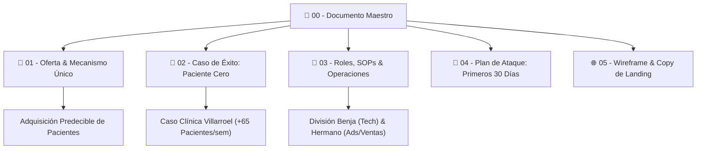
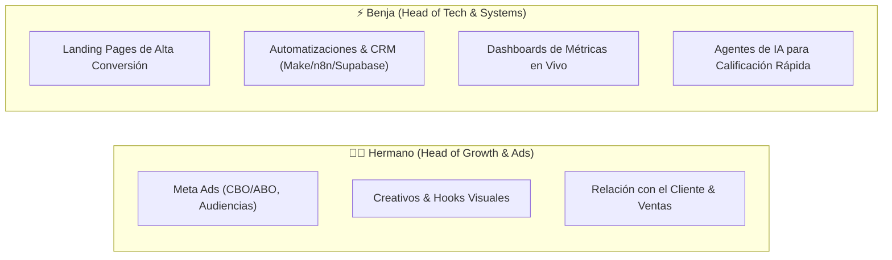

# 📌 AGENCIA DE SCALING — DOCUMENTO MAESTRO

> [!ABSTRACT] Resumen Ejecutivo
> Este documento representa la **fuente de verdad operacional y estratégica** de nuestra agencia de scaling. No somos una agencia tradicional de marketing ni un estudio creativo: somos **Growth Partners** especializados en la adquisición predecible de pacientes de alto valor para clínicas odontológicas y centros médicos a través de infraestructura tecnológica, tráfico quirúrgico y automatización con IA.

---

## 🗺️ Mapa de Navegación del Vault



- [[01 - 💎 Oferta Irresistible y Mecanismo Único|01. Oferta Irresistible & Mecanismo Único]]
- [[02 - 🎯 Caso de Éxito Paciente Cero (Clínica Villarroel)|02. Caso de Éxito Paciente Cero]]
- [[03 - 👥 Roles, División Operativa y SOPs|03. Roles, División Operativa y SOPs]]
- [[04 - 🚀 Plan de Ataque — Primeros 30 Días|04. Plan de Ataque — Primeros 30 Días]]
- [[05 - 🌐 Wireframe & Copywriting de la Landing Page|05. Wireframe & Copywriting de Landing Page]]

---

## 1. 🏷️ Nombre & Posicionamiento de Marca

> [!IMPORTANT] Principio Clave de Branding
> El nombre debe transmitir **velocidad, escala, ingeniería y resultados**, alejándose por completo de palabras genéricas como *"Marketing"*, *"Creative Agency"* o *"Digital Lab"*.

### Opciones de Naming (con ancla en la marca personal)
1. **`Fuentes Scale`** — *Conciso, institucional, directo al grano.*
2. **`Fuentes Growth Co.`** — *Sonoridad de firma consultora/partner estratégico.*
3. **`Velo Scaling`** — *Enfocado en velocidad de ejecución y tracción rápida.*
4. **`Compound Partners`** — *Metáfora de crecimiento compuesto e inversión recurrente.*
5. **`Northstar Growth`** — *Orientación hacia la métrica reina del cliente.*

### 🎯 Posicionamiento Oficial
> **"Growth Partners para clínicas dentales y médicas."**

```
❌ Lo que NO somos: "Una agencia de marketing que hace posts, flyers o community management."
✅ Lo que SÍ somos: "Un socio de crecimiento que inyecta pacientes calificados en la agenda de tu clínica."
```

---

## 2. ⚡ La Oferta Central (One-Liner)

> [!QUOTE] La Oferta en una Sola Frase
> **"Escalamos la adquisición de pacientes de tu clínica integrando tráfico pago de alta precisión + infraestructura de conversión (web ultrarrápida, automatizaciones WhatsApp e IA)."**

**Regla de Oro:** Nosotros no vendemos "anuncios en Facebook" ni "páginas web bonitas". Vendemos **pacientes agendados y salas de espera llenas**.

---

## 3. 💰 Modelo de Precios & Estructura de Ingresos

| Componente | Qué es exactamente | Naturaleza & Justificación |
| :--- | :--- | :--- |
| **Setup Fee** *(One-time)* | Auditoría técnica, pixel setup, CBO framework, landing page de conversión, webhook & workflows WhatsApp. | **No negociable.** Cubre los costos fijos de ingeniería de arranque. |
| **Management Fee** *(Mensual)* | Optimización diaria de campañas, testing de creativos A/B, soporte técnico y dashboards en vivo. | **Ingreso recurrente (MRR).** Estabilidad de flujo de caja. |
| **Garantía Acotada** | *"Si no generamos $X$ leads calificados en 30 días, gestionamos gratis el mes siguiente."* | **Elimina la fricción de venta** sin atar el fee a la facturación clínica externa. |

> [!CAUTION] Sobre la Garantía
> **NUNCA** atar la garantía a "facturación total de la clínica", porque la venta final dentro del box odontológico depende del doctor y su recepcionista, no del tráfico. La garantía se mide en **Leads calificados con interés explícito agendados en el sistema**.

---

## 4. 👥 División de Roles Fundacionales



Consulte el desglose completo en: [[03 - 👥 Roles, División Operativa y SOPs]].

---

## 5. 🏆 Caso de Éxito — "Paciente Cero" (Clínica Villarroel)

> [!TIP] El Activo de Ventas #1
> Este caso de éxito es la palanca con la que cerraremos los primeros 5 clientes externos sin necesidad de gastar en anuncios propios.

- **Antes:** Agenda con huecos, dependencia 100% de recomendaciones boca a boca.
- **Después:** **+65 pacientes en una sola semana**, calendario saturado, previsibilidad de ingresos.
- **Activos a recopilar:** Capturas anonimizadas de WhatsApp Business, métricas de Meta Ads Manager (CPL, CTR, CPC), panel de reservas.

Consulte el caso detallado en: [[02 - 🎯 Caso de Éxito Paciente Cero (Clínica Villarroel)]].

---

## 6. 🌐 Arquitectura de la Landing Page

La landing page de la agencia debe seguir una estructura psicológica de conversión directa:
1. **Hero:** *"Exclusivo para clínicas dentales y médicas"* + Propuesta de valor clara + CTA calificador.
2. **Social Proof:** Caso Clínica Villarroel con datos duros.
3. **El Mecanismo en 3 Pilares:** Tráfico Quirúrgico + Infraestructura de Conversión + Partnership Real.
4. **Oferta & Garantía Transparente:** Sin letra chica.
5. **Formulario de Calificación:** Filtro de clientes con capacidad instalada para crecer.

Consulte la estructura y copies en: [[05 - 🌐 Wireframe & Copywriting de la Landing Page]].

---

## 7. 📱 Estrategia de Canales & Autoridad

- **Instagram:** Canal principal de autoridad (Behind the scenes, breakdowns de campañas, micro-vídeos mostrando cómo llenamos agendas).
- **LinkedIn:** Posicionamiento institucional para conectar con dueños de clínicas y directores médicos.
- **Outbound Directo:** Contacto personalizado vía Instagram DM y WhatsApp corporativo ofreciendo una *"Auditoría de Adquisición de Pacientes"*.

---

## 8. 📊 Métricas Operacionales Clave (KPIs)

$$CAC = \frac{\text{Gasto Total en Ads}}{\text{Pacientes Nuevos Agendados}}$$

$$CPL = \frac{\text{Gasto Total en Ads}}{\text{Leads Calificados Recibidos}}$$

$$CR_{Landing} = \left( \frac{\text{Formularios Enviados}}{\text{Visitas Únicas}} \right) \times 100$$

---

## 🚀 Próximos Pasos Inmediatos
- [ ] Definir el nombre final entre los dos socios (`Fuentes Growth Co.` / `Fuentes Scale`).
- [ ] Compilar las capturas y métricas finales de la Clínica Villarroel.
- [ ] Lanzar el entorno local de la Landing Page para la agencia.
