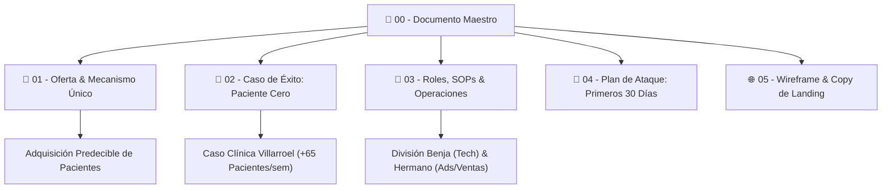
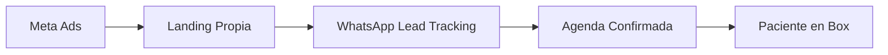
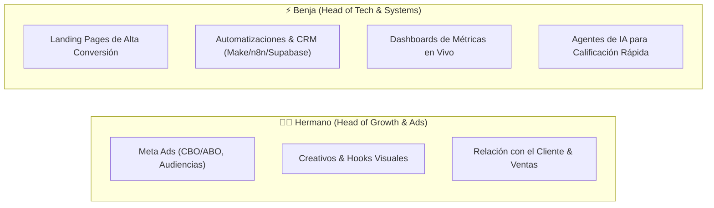

# 📌 LIGHT PARTNERS — DOCUMENTO MAESTRO

> [!ABSTRACT] Resumen Ejecutivo
> Este documento representa la **fuente de verdad operacional y estratégica** de **LIGHT PARTNERS**. No somos una agencia tradicional de marketing ni un estudio creativo: somos **Growth Partners** especializados en la adquisición predecible de pacientes de alto valor para clínicas odontológicas y centros médicos a través de infraestructura tecnológica, tráfico quirúrgico y automatización con IA.

---

## 🗺️ Mapa de Navegación del Vault



- [[01 - 💎 Oferta Irresistible y Mecanismo Único|01. Oferta Irresistible & Mecanismo Único]]
- [[02 - 🎯 Caso de Éxito Paciente Cero (Clínica Villarroel)|02. Caso de Éxito Paciente Cero]]
- [[03 - 👥 Roles, División Operativa y SOPs|03. Roles, División Operativa y SOPs]]
- [[04 - 🚀 Plan de Ataque — Primeros 30 Días|04. Plan de Ataque — Primeros 30 Días]]
- [[05 - 🌐 Wireframe & Copywriting de la Landing Page|05. Wireframe & Copywriting de Landing Page]]

---

## 1. 🏷️ Identidad & Posicionamiento: LIGHT PARTNERS

> [!IMPORTANT] Principio Clave de Branding
> **LIGHT PARTNERS** transmite claridad, elegancia y precisión. Nos posicionamos como una firma boutique de ingeniería de crecimiento: no vendemos campañas sueltas ni diseño por encargo, construimos el sistema completo que convierte demanda en pacientes.

### 🎯 Posicionamiento Oficial
> **"Growth Partners para clínicas dentales y médicas."**

```
❌ Lo que NO somos: "Una agencia de marketing que hace posts, flyers o community management."
✅ Lo que SÍ somos: "Un socio de crecimiento que inyecta pacientes calificados en la agenda de tu clínica."
```

---

## 2. ⚡ La Oferta Central & Diagrama de Flujo

> [!QUOTE] La Oferta en una Sola Frase
> **"Diseñamos el sistema de adquisición de pacientes para clínicas que ya son excelentes en lo suyo y necesitan que se note: tráfico de precisión, infraestructura de conversión y reportes que no dejan dudas."**



---

## 3. 💰 Modelo de Precios & Estructura de Ingresos

| Componente | Qué es exactamente | Naturaleza & Justificación |
| :--- | :--- | :--- |
| **Setup Fee** *(Pago único)* | Integración técnica: cuenta de ads, pixel, landing de conversión y flujo de automatización. | **No negociable.** Cubre los costos de arranque técnico. |
| **Fee Mensual** *(Recurrente)* | Gestión continua de campañas, optimización de creativos y reporting quincenal. | **Ingreso recurrente (MRR).** Predecible y auditable. |
| **Garantía Acotada** | *"Definimos un objetivo concreto de leads calificados. Si no lo alcanzamos en los primeros 30 días, gestionamos la cuenta sin honorarios adicionales ese mes."* | **Elimina la fricción de venta.** La inversión en pauta sigue siendo 100% propiedad del cliente. |

---

## 4. 👥 División de Roles Fundacionales



---

## 5. 🏆 Caso de Éxito — "Paciente Cero" (Clínica Villarroel)

- **Antes:** Dependencia casi absoluta de referidos boca a boca, agenda con espacios vacíos a mitad de semana.
- **Después:** **+65 pacientes nuevos en una sola semana**, 14 días de implementación a resultados.
- **Activo #1 de Ventas:** Capturas del panel de resultados y agenda completa.

---

## 6. 📊 Métricas a Trackear Siempre

$$CAC = \frac{\text{Gasto Total en Ads}}{\text{Pacientes Nuevos Agendados}}$$

$$CPL = \frac{\text{Gasto Total en Ads}}{\text{Leads Calificados Recibidos}}$$

$$CR_{Landing} = \left( \frac{\text{Formularios Enviados}}{\text{Visitas Únicas}} \right) \times 100$$

---

## 7. 💬 Canales & Comunicación
- 🎮 **Discord Oficial:** [light partners Discord](https://discord.gg/GWeSmF49m)
- 🌐 **Web en Producción:** [light-partners.vercel.app](https://light-partners.vercel.app)
- 🐙 **Repo GitHub:** [github.com/b3njaminfuentes/scaling-agency](https://github.com/b3njaminfuentes/scaling-agency)


