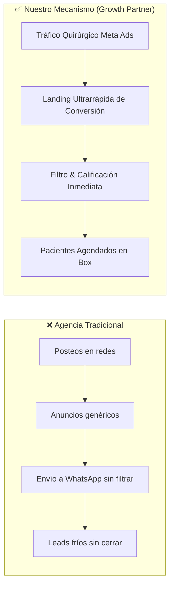

# 💎 Oferta Irresistible y Mecanismo Único

> [!NOTE] Enlace con Documento Maestro
> Regresar a: [[00 - 📌 Documento Maestro — Scaling Agency|📌 Documento Maestro]]

---

## 1. El Concepto: "Adquisición Predictiva de Pacientes"

La mayoría de los odontólogos y médicos han sido quemados por agencias tradicionales que les prometieron "likes", "alcance" o "branding". Nuestro diferencial no es una característica técnica, sino un **Mecanismo Único**.

---

## 2. La Ecuación de Valor (Alex Hormozi Framework)

$$\text{Valor Percibido} = \frac{\text{Resultado Soñado (Agenda Llena)} \times \text{Certeza Percibida (Caso Villarroel)}}{\text{Tiempo de Espera (7-14 días)} \times \text{Esfuerzo y Sacrificio del Doctor (Mínimo)}}$$

1. **Resultado Soñado:** Añadir entre 30 y 60 pacientes nuevos de alto valor al mes (implantes, ortodoncia, estética dental, consultas médicas especializadas).
2. **Certeza Percibida:** Respaldada por métricas reales (65 pacientes en 1 semana en el caso cero) y garantía de servicio.
3. **Tiempo de Espera:** Sistema montado y operativo en menos de 7 días hábiles tras el kickoff.
4. **Esfuerzo del Cliente:** Solo deben atender a los pacientes calificados que llegan agendados.

---

## 3. Matriz Detallada de Precios

| Paquete / Servicio | Inversión Cliente | Qué Incluye | Para Quién Es |
| :--- | :--- | :--- | :--- |
| **Growth Launchpad (Piloto / Core)** | **Setup:** \$400 - \$600 USD *(único)* **Retainer:** \$600 - \$900 USD/mes | • Arquitectura de Landing Page de alta velocidad • Pixel & Conversion API setup • Campañas CBO Meta Ads • Automatización de WhatsApp / CRM • Dashboard semanal de métricas | Clínicas con 1 a 3 sillones/boxes que necesitan flujo constante. |
| **Scale Partner (Avanzado)** | **Setup:** \$750 USD *(único)* **Retainer:** \$1,200 USD/mes + % sobre ad spend escalado | • Todo lo anterior + • 2 funnels simultáneos (ej: Ortodoncia + Implantes) • Asistente de IA para pre-calificación • Grabación y testing continuo de UGC creativos | Clínicas medianas/grandes con múltiples especialistas. |

---

## 4. La Garantía Acotada (Risk Reversal)

> [!IMPORTANT] Cláusula de Garantía Específica
> *"Si en los primeros 30 días de campaña activa no te generamos al menos **$X$ leads calificados** (con nombre, teléfono y necesidad médica explícita), trabajamos el segundo mes completamente **GRATIS** en concepto de gestión hasta alcanzar la meta."*

### Por qué esta garantía funciona:
- **Seguridad para el cliente:** Elimina el miedo a perder la inversión de gestión.
- **Seguridad para nosotros:** El cliente sigue pagando su presupuesto publicitario directo a Meta, por lo que nunca financiamos anuncios ajenos.
- **Medible y auditable:** Todo queda registrado en nuestro dashboard de Supabase / Make / Google Sheets compartido.

---

## 5. Criterios de Calificación del Cliente (ICP - Ideal Customer Profile)

> [!CHECKLIST] Requisitos Obligatorios para Aceptar un Cliente
> - [ ] Tiene al menos 1 recepcionista o persona encargada de responder mensajes en menos de 15 minutos.
> - [ ] Capacidad instalada para absorber al menos +20-30 pacientes nuevos al mes.
> - [ ] Presupuesto mínimo de inversión en pauta publicitaria (Meta Ads) de **\$250 - \$500 USD/mes** adicional a nuestro fee.
> - [ ] Tratamientos con ticket promedio superior a \$50 USD (evitar clientes que solo viven de limpiezas gratuitas).
