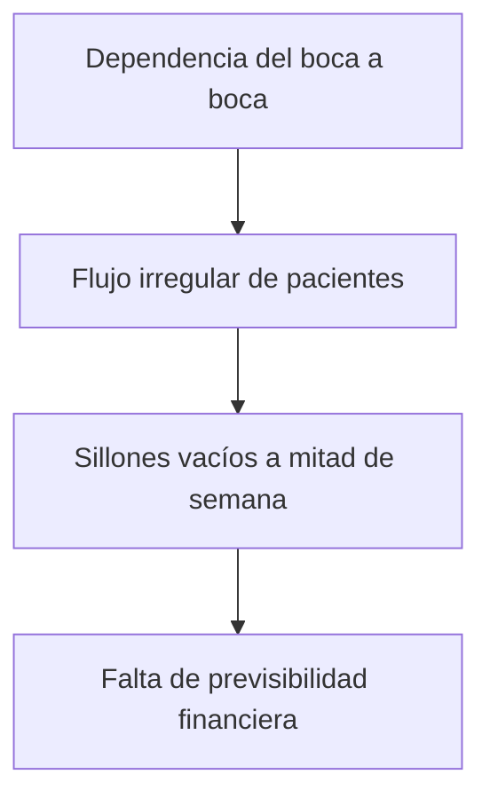

# 🎯 Caso de Éxito: "Paciente Cero" (Clínica Villarroel)

> [!NOTE] Enlace con Documento Maestro
> Regresar a: [[00 - 📌 Documento Maestro — Scaling Agency|📌 Documento Maestro]]

---

## 1. 📋 Ficha Técnica del Caso de Estudio

| Parámetro | Datos Registrados |
| :--- | :--- |
| **Cliente / Nicho** | Clínica Dental & Especialidades Médicas |
| **Duración de la Campaña Piloto** | 7 Días (Semana 1) |
| **Resultado de Adquisición** | **65 Pacientes Agendados en 1 Semana** |
| **Inversión Publicitaria** | *[Completar con monto exacto en \$]* |
| **Costo por Paciente Agendado (CAC)** | *[Completar: Ad Spend / 65]* |
| **Tasa de Cierre en Box** | *[Completar: % que asistió a la cita]* |

---

## 2. 🔍 Diagnóstico Inicial: El Problema (Antes)

- Agenda con días de baja ocupación.
- Cero adquisición digital sistemática.
- Intentos previos de "manejo de redes sociales" con alcance pero sin pacientes reales.

---

## 3. ⚙️ La Intervención: Qué Implementamos (Solución)

### A. Tráfico Quirúrgico (Meta Ads - Media Buyer)
- Segmentación local hiper-enfocada (radio de 3 a 7 km alrededor de la clínica).
- Creativos basados en dolor/solución directa:
  - Hook visual de cercanía y profesionalismo médico.
  - Llamado a la acción con incentivo de evaluación inicial o cupos limitados por semana.

### B. Infraestructura de Conversión & Respuesta Inmediata (Tech Lead)
- Landing page de carga instantánea (< 1.2s) optimizada para smartphones.
- Sistema de captura de datos con validación en tiempo real.
- Enrutamiento directo a WhatsApp con mensaje pre-rellenado para reducir la fricción a cero.

---

## 4. 📈 Los Resultados (El Después)

> [!SUCCESS] Impacto Directo en Facturación
> - **65 pacientes agendados** en los primeros 7 días de campaña.
> - Saturación de la agenda de consultas y evaluaciones.
> - Validación empírica de que el modelo **Tráfico + Funnel de Conversión** supera por 10x al marketing tradicional de agencias.

---

## 5. 📸 Checklist de Activos de Venta a Recopilar

> [!CHECKLIST] Documentos que Deben Estar en Nuestra Carpeta de Ventas
> - [ ] Captura del panel de Meta Ads Manager mostrando: *Gasto, Clics, Leads, CPL*.
> - [ ] Captura anonimizada del calendario / agenda de la clínica repleta de citas.
> - [ ] Testimonio en video o audio de la doctora / encargada de recepción validando el aluvión de consultas.
> - [ ] Gráfico comparativo de pacientes semanales: *Antes (10-15) vs Después (65+)*.
