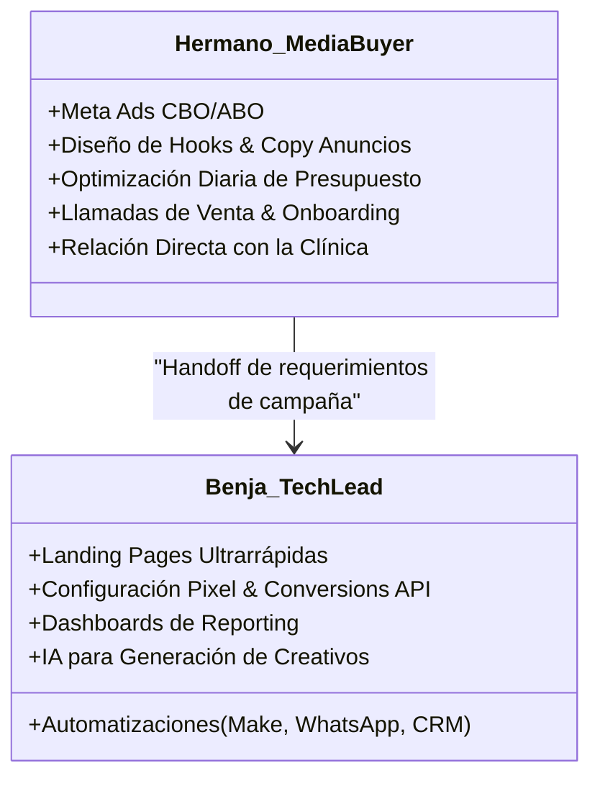
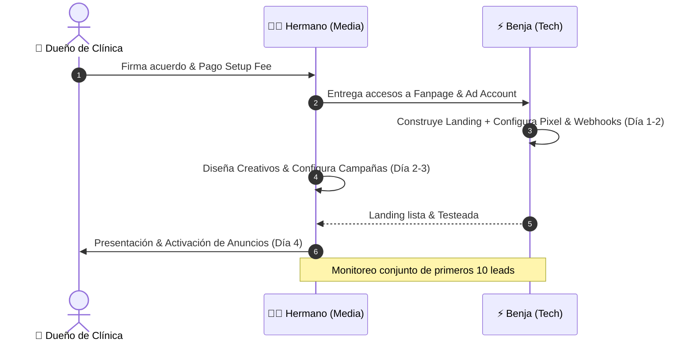

# 👥 Roles, División Operativa y SOPs

> [!NOTE] Enlace con Documento Maestro
> Regresar a: [[00 - 📌 Documento Maestro — Scaling Agency|📌 Documento Maestro]]

---

## 1. 🤝 Matriz de Responsabilidades (RACI Simplificada)

---

## 2. 🧑‍💻 SOP: Hermano — Head of Media & Client Operations

### A. Tareas Diarias
1. **Revisión de Campañas (09:00 AM):**
   - Verificar que el CPL (Costo por Lead) no supere el umbral acordado.
   - Apagar ad sets con más de 3 días de fatiga o gasto sin conversiones.
2. **Revisión de Leads con el Cliente:**
   - Comprobar que la recepcionista esté contactando a los leads en < 15 min.

### B. Tareas Semanales
1. **Lanzamiento de Nuevos Creativos:** Probar 2-3 variaciones de video o imagen con diferentes ángulos de dolor.
2. **Reunión de Sincronización:** Llamada de 15 minutos con el dueño de la clínica para revisar agenda y pacientes que asistieron.

---

## 3. ⚡ SOP: Benja — Head of Technology & Conversion Architecture

### A. Setup de Nuevo Cliente (48 horas)
1. **Landing Page Deployment:**
   - Montar landing page optimizada en subdominio o dominio del cliente.
   - Carga en menos de 1.5s, Mobile-First 100%.
2. **Tracking & Analytics:**
   - Meta Pixel + Conversion API (CAPI) vía servidor/webhook.
   - Eventos personalizados: `ViewContent`, `InitiateCheckout`, `Lead_Qualified`.
3. **Automatización de Notificaciones:**
   - Al recibir lead -> Notificación inmediata por WhatsApp/Telegram a la recepcionista con datos del paciente.

### B. Mantenimiento & Analítica
- Supervisión del uptime de las páginas y webhooks.
- Actualización de dashboards de Supabase / Looker Studio.
- Implementación de prompts de IA para redactar variantes de anuncios y guiones de venta.

---

## 4. 🔄 Flujo de Trabajo para Nuevos Clientes (Kickoff a Lanzamiento)

