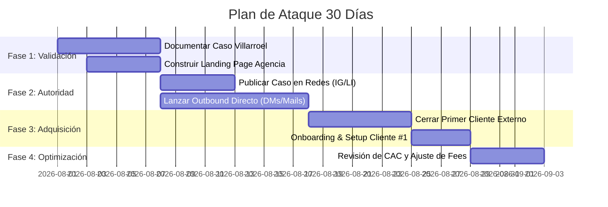

# 🚀 Plan de Ataque — Primeros 30 Días

> [!NOTE] Enlace con Documento Maestro
> Regresar a: [[00 - 📌 Documento Maestro — Scaling Agency|📌 Documento Maestro]]

---

## 📅 Cronograma Táctico Semana a Semana

---

### 🟢 Semana 1 - 2: Fundación & Activo Maestro
- [ ] **Documentación exhaustiva de la Clínica de mamá (Villarroel):**
  - Sacar capturas claras del panel de Meta Ads con resultados reales (65 pacientes/semana).
  - Calcular inversión neta, CPL y CAC.
- [ ] **Desarrollo y deployment de la Landing Page de la Agencia:**
  - Montar en dominio oficial (ej: `fuentesgrowth.co` o `fuentes-scale.com`).
  - Integrar formulario interactivo de calificación.

### 🟡 Semana 2 - 3: Autoridad & Prospección Outbound
- [ ] **Estrategia de Instagram / Redes Sociales:**
  - Post carrusel / Reel: *"Cómo llenamos la agenda de una clínica odontológica con 65 pacientes en 7 días sin regalar tratamientos"*.
  - Mostrar capturas y backstage técnico de la infraestructura.
- [ ] **Prospección Quirúrgica (Outbound B2B):**
  - Identificar 50 clínicas dentales locales en Instagram / Google Maps con poca o mala publicidad activa.
  - Enviar video-auditoría personalizada (Loom de 2 min): *"Hola Dr. [Nombre], vi sus anuncios y noté que están perdiendo hasta el 70% de pacientes potenciales porque no tienen un sistema de respuesta rápida. Le preparé un video breve de cómo lo solucionamos..."*.

### 🟠 Semana 3 - 4: Primer Cliente Externo & Validación
- [ ] Conducir llamadas de diagnóstico (15-20 min).
- [ ] Presentar la **Oferta con Garantía Acotada** (con precio de lanzamiento o setup bonificado a cambio de testimonio en video).
- [ ] Iniciar Setup de 48 horas y lanzar campañas.

### 🔴 Fin de Mes: Revisión de Unidad Económica
- [ ] Evaluar métricas reales:
  $$\text{ROI de Adquisición} = \frac{\text{Ingresos por Retainers}}{\text{Tiempo \& Costos de Setup}}$$
- [ ] Ajustar el precio del Setup Fee hacia arriba con 2 casos de éxito en mano.
