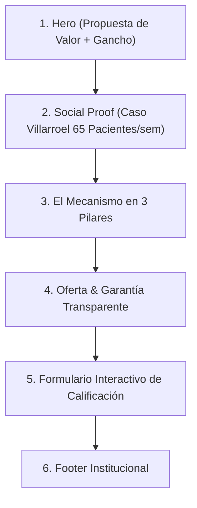

# 🌐 Wireframe & Copywriting de la Landing Page

> [!NOTE] Enlace con Documento Maestro
> Regresar a: [[00 - 📌 Documento Maestro — Scaling Agency|📌 Documento Maestro]]

---

## 📐 Estructura Psicológica Sección por Sección



---

### Seccion 1: Hero Section
- **Kicker / Pre-título:** `[ EXCLUSIVO PARA CLÍNICAS DENTALES Y CENTROS MÉDICOS ]`
- **H1 Principal:** *"Escalamos la agenda de tu clínica con un sistema predecible de adquisición de pacientes."*
- **Subtítulo:** *"Integramos tráfico pago de alta precisión, landing pages de carga instantánea y automatización de respuesta con IA para llenar tus boxes de consultas de alto valor."*
- **Botón CTA Primario:** `[ Comprobar si mi clínica califica → ]` (Desplaza automáticamente al formulario).
- **Micro-social proof:** *"★ Más de 65 pacientes nuevos generados en 7 días en nuestro último caso de estudio."*

---

### Sección 2: Caso de Éxito en Números Reales (Caso Clínica Villarroel)
- **Título de Sección:** *"Resultados Reales. Sin humo, sin promesas vacías."*
- **Layout:**
  - **Columna Izquierda:** Resumen del desafío y la solución técnica implementada.
  - **Columna Derecha:** Tarjetas con métricas destacadas:
    - **`65`** *Pacientes agendados en solo 7 días.*
    - **`< 1.2s`** *Velocidad de carga de la infraestructura.*
    - **`100%`** *Trazabilidad de leads a citas confirmadas.*

---

### Sección 3: El Mecanismo Único (3 Columnas)

1. **Columna 1: Tráfico Quirúrgico Meta Ads (Media Buyer)**
   - *"Anuncios hipersegmentados que atraen a pacientes que buscan activamente tratamientos de alto ticket en tu zona geográfica exacta."*
2. **Columna 2: Infraestructura de Alta Conversión (Tech Lead)**
   - *"Embudos de venta ultrarrápidos y conexiones instantáneas a WhatsApp para evitar que los leads se enfríen."*
3. **Columna 3: Modelo de Partnership & Garantía**
   - *"Trabajamos alineados con tus resultados: si no alcanzamos la cuota acordada de leads calificados, no cobramos gestión el siguiente mes."*

---

### Sección 4: Oferta & Garantía Sin Riesgo
- **Título:** *"Un modelo donde solo ganamos si tu clínica crece."*
- **Puntos clave:**
  - Setup único con toda la ingeniería lista.
  - Fee mensual transparente de gestión.
  - Garantía escrita: *Si no generamos los leads calificados pactados en 30 días, el siguiente mes de gestión es 100% gratuito.*

---

### Sección 5: Formulario Interactivo de Calificación (Lead Qualifier)

```
[ PASO 1 / 3: Información Básica ]
- Nombre completo del doctor / director: [ ________________ ]
- Nombre de la clínica: [ ________________ ]
- Teléfono / WhatsApp: [ ________________ ]
- Instagram o Web de la clínica: [ ________________ ]

[ PASO 2 / 3: Capacidad Operativa ]
- Volumen actual de pacientes nuevos al mes:
  ( ) 0 a 10 pacientes
  ( ) 10 a 30 pacientes
  ( ) 30 a 50+ pacientes
- ¿Tienen capacidad de recepción para absorber +30 pacientes adicionales este mes?
  ( ) Sí, contamos con disponibilidad
  ( ) No en este momento

[ PASO 3 / 3: Desafío Principal ]
- ¿Cuál es el mayor obstáculo actual para escalar la clínica?
  [ Texto abierto... ]

[ BOTÓN FINAL: Enviar Aplicación y Agendar Llamada de Diagnóstico ]
```
